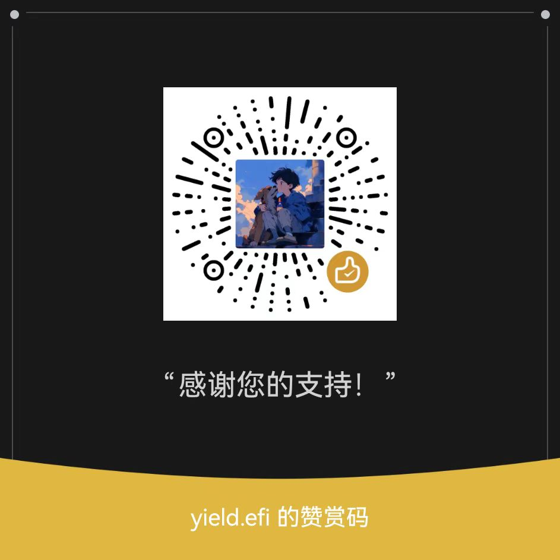

首先，感谢您有想支持本项目的想法！我真的是太感动了😭 ❤️

!!! tip "提示"

    如果你喜欢这个项目，也有其他简单的方法可以支持该项目并表达您的感激之情，例如给这个项目加 Star！非常感谢！⭐

下面是我的赞助方式：

<p align="center">

</p>

请在赞助时注明一些信息，例如：

```linenums="0"
Webintosh [你的昵称或者你的 GitHub 用户名]
```

~~不然我就当私人收入了（~~

我会将 `[你的昵称或者你的 GitHub 用户名]` 和你赞助的时间与金额放在下面！当然，你也可以匿名。

本页面将尽可能持续更新，以尽可能列出所有给出金钱赞助的人！非常感谢！

此页面并非自动更新，而是由我手动更新的，因此赞助列表可能更新不及时，甚至很久都没有更新！请谅解。

| 🕓 赞助时间 { data-sort-method=min } |             😀 赞助者              | 💰 赞助金额 { data-sort-method=number } |
| :---------------------------------: | :-------------------------------: | :------------------------------------: |
|         2025-02-08 21:26:34         |            <https://github.com/CodeCrafter-TL>            |                 ¥0.00                 |
